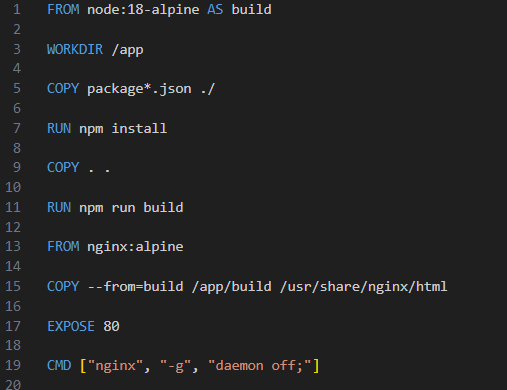
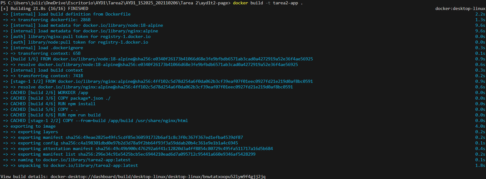
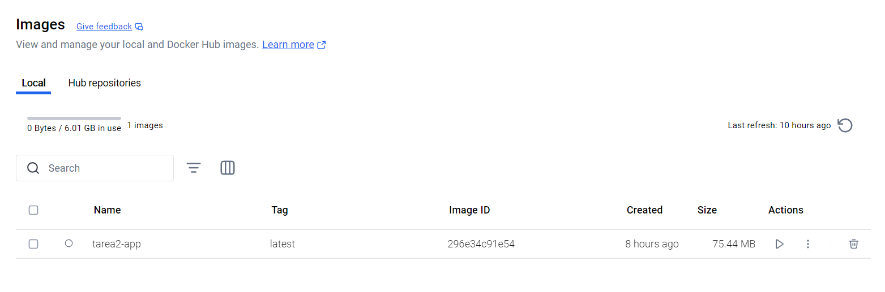
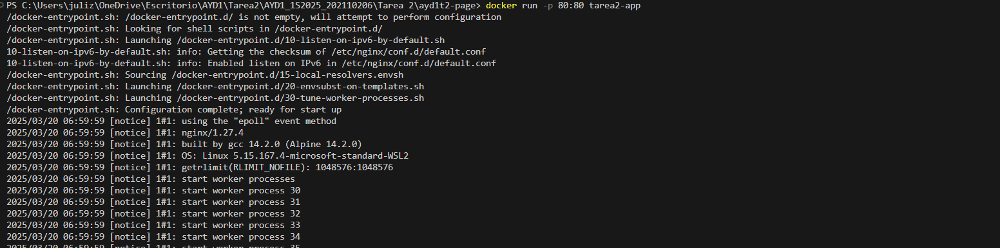
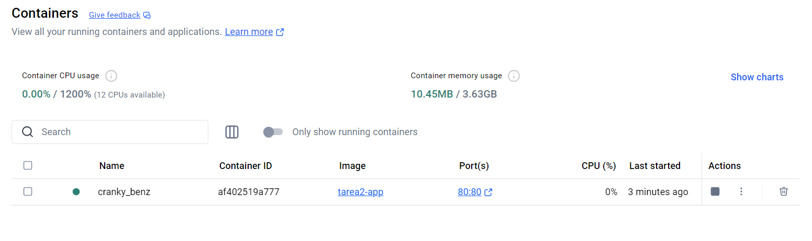
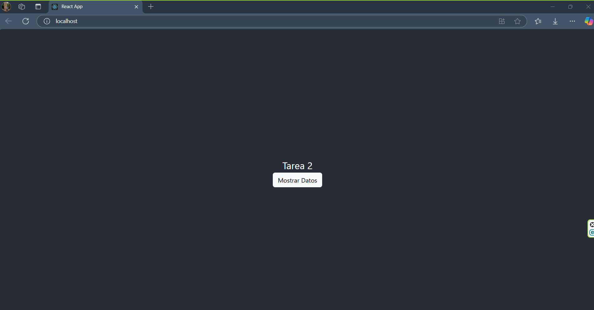
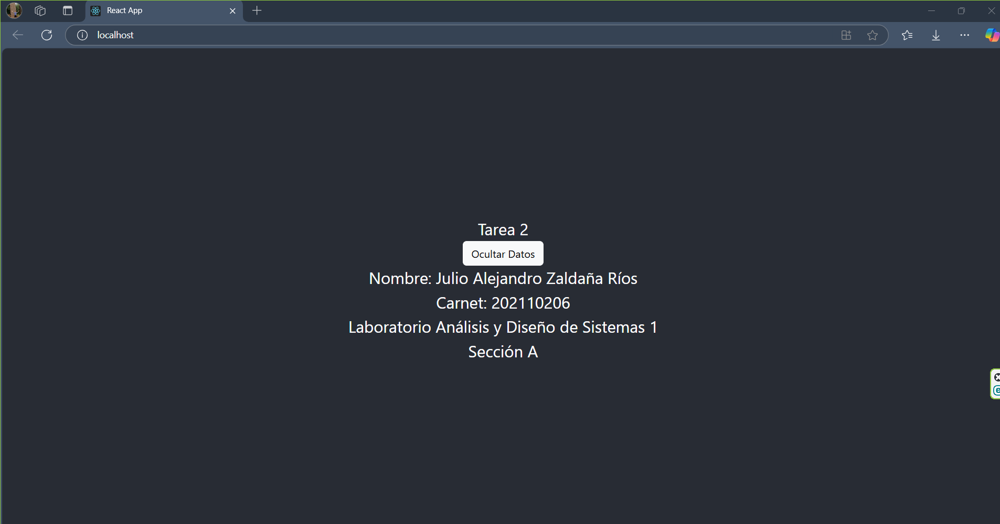

## <div align="center"> Tarea 2 </div>
### <div align="center"> Docker y React: Creación de imagen y contenedor  </div>
*<div align="center"> ¨Nombre: Julio Alejandro Zaldaña Ríos 
Carnet: 202110206
20/03/2025</div>*

<div align="center">

 
</div>

___ 

En la tarea 2 del curso de Analisis y Diseño de Sistemas 1, se ha trabajado con el framework de React JS para poder desplegar en una pantalla sencilla con un boton que al presionar, muestra mis datos personales.

En este caso se ha utilizado Docker, para poder desplegar y contenerizar la aplicación de React JS, y poder correrla en el puerto 80.

A continuación se mostrará una serie de pasos, para la utilización de Docker de forma correcta.


____


**Construir una imagen basada en el archivo Dockerfile**

Para poder construir la imagen de la aplicación, se construye un archivo Dockerfile, el cual se encuentra en la carpeta raíz del proyecto. 

Este tiene una estructura:

<div align="center">

</div>

Explicación:

1. **FROM node:18-alpine AS build:** Usa la imagen base de Node.js 18 en su versión alpine (iamgen ligera) para crear una etapa de construcción llamada build.

2. **WORKDIR /app:** Establece el directorio de trabajo en /app dentro del contenedor.

3. ***COPY package*.json ./:**: Copia los archivos package.json y package-lock.json al directorio de trabajo dentro del contenedor.
4. **RUN npm install**: Instala las dependencias del proyecto listadas en package.json.
5. **COPY . .:**: Copia el código fuente completo de la aplicación al contenedor.
6. **RUN npm run build:** Ejecuta el comando npm run build, que genera los archivos estáticos optimizados de React dentro de la carpeta build.
7. **FROM nginx:alpine:** Usa la imagen ligera de Nginx para servir los archivos estáticos generados por React.
8. **COPY --from=build /app/build /usr/share/nginx/html:** Copia los archivos generados en la etapa build (/app/build) al directorio de Nginx (/usr/share/nginx/html), desde donde serán servidos.
9. **EXPOSE 80:** Expone el puerto 80, que es el puerto por defecto de Nginx para servir contenido web.
10. **CMD ["nginx", "-g", "daemon off;"]:** Inicia Nginx en primer plano (daemon off; evita que se ejecute en segundo plano) para que el contenedor siga en ejecución.

____

#### **Construcción de imagen**

```
docker build -t tarea2-app .
```

<div align="center">

</div>

Si se tiene el sistema operativo de Windows y se tiene Docker Desktop, se puede observar de forma gráfica las imagenes que están creadas:

<div align="center">

</div>

#### **Construcción de contenedor basado en la imagen**


```
docker run -d -p 80:80 tarea2-app
```

Flags:
-d: (Para dejarlo en segundo plano)
-p: (Mapea un puerto del host a un puerto dentro del contenedor.)

<div align="center">

</div>

De igual manera se puede observar en Docker Desktop; la inicialización de los contenedores:

<div align="center">

</div>

**Muestra de pantalla:**

Al ingresar en localhost:80

<div align="center">

</div>

Al presionar el botón, se podrán ver mis datos personales.

<div align="center">

</div>